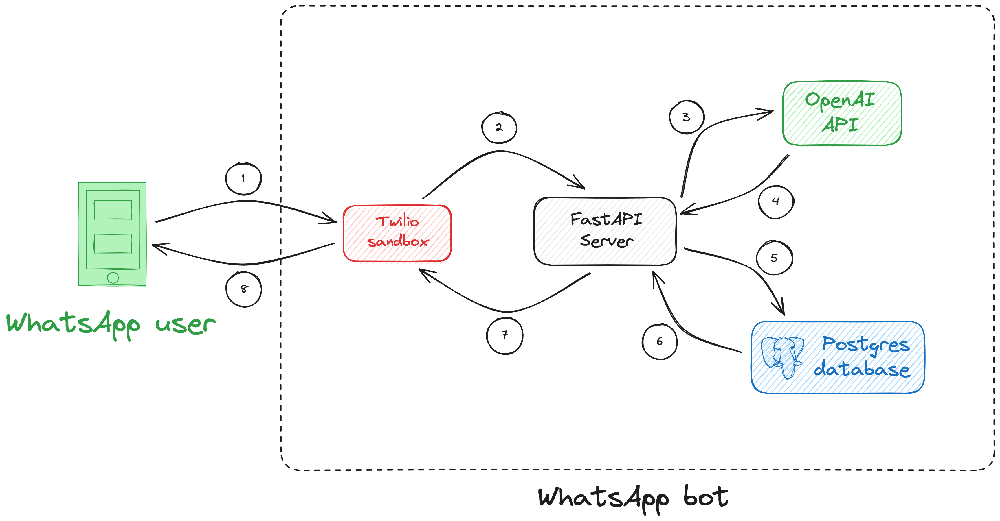
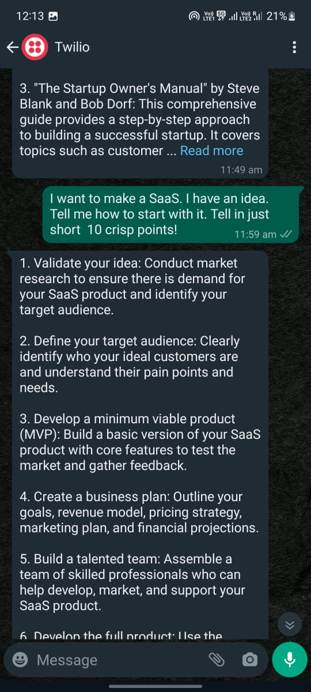
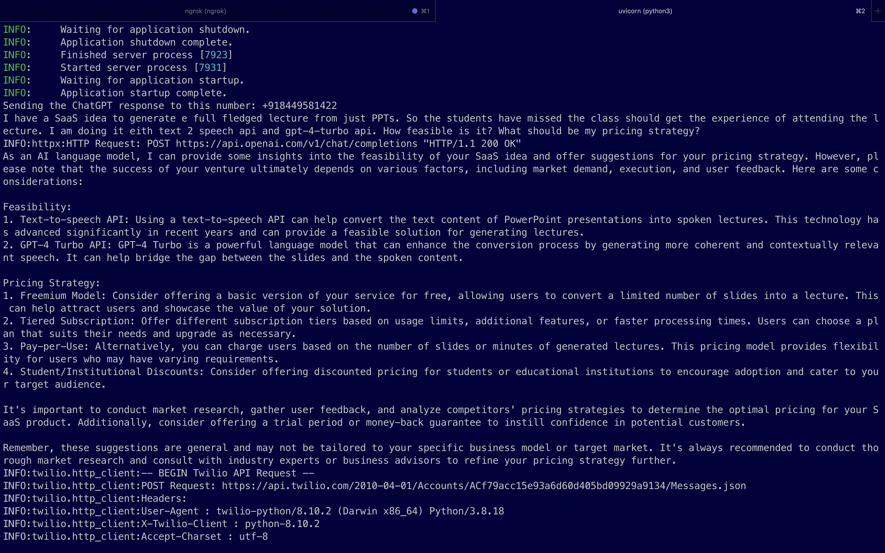
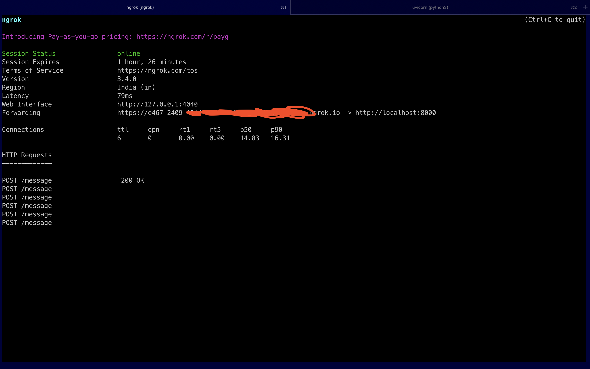

<a name="readme-top"></a>

<!-- PROJECT LOGO -->
<br />
<div align="center">
  <a href="https://github.com/ayushgml/chatgpt-whatsapp-bot">
  
  </a>

  <h1 align="center">GPT WhatsApp Bot</h1>
    
</div>


## About The Project
The GPT WhatsApp bot is a simple WhatsApp bot that uses the GPT-3.5 model using OpenAI API to generate responses to messages sent by the user. The bot is built using the Twilio API and the OpenAI API. 
The project is a FastAPI application that uses the OpenAI API to generate responses to incoming messages. It also logs the conversation in a database using SQLAlchemy.

## Built With
 * [Python](https://www.python.org/)
 * [OpenAI API](https://beta.openai.com/)
 * [Twilio API](https://www.twilio.com/)
 * [SQLAlchemy](https://www.sqlalchemy.org/)
 * [PostgreSQL](https://www.postgresql.org/)
 * [FastAPI](https://fastapi.tiangolo.com/)

## Project files
 * ```main.py```: This file is a Python script that sets up a FastAPI server to handle incoming webhook requests. It uses the OpenAI API to generate responses using ChatGPT. The conversation data is stored in a postgres database and the response is sent back to the user via a messaging service.
 * ```utils.py```: This file contains a function send_message that uses the Twilio Messaging API to send WhatsApp messages. It splits the message into substrings of 1600 characters or less and sends each substring as a separate message. This has been done to prevent the 1600 character limit exception by Twilio API. The Twilio client is initialized with the necessary credentials from the decouple library.
 * ```models.py```: This file contains the SQLAlchemy models for the database. It contains the Conversation model that stores the conversation data in the database.
 * ```.env```: Structure the env file like this:

    ```
      DB_USER=
      DB_PASSWORD=
      TWILIO_ACCOUNT_SID=
      TWILIO_AUTH_TOKEN=
      TWILIO_NUMBER=
      OPENAI_API_KEY=
    ```
  * ```requirements.txt```: This file contains the list of all the dependencies required to run the project. 
  * ```Dockerfile```: This file contains the Dockerfile for the project. It contains the instructions to build the Docker image for the project.

## Architecture and Working


1. User sends the message to the twilio sandbox number
2. Twilio sends a webhook request to the FastAPI server
3. The FastAPI server requests the OpenAI API
4. The API response is received from the OpenAI API
5. The response is stred in the database
6. The confirmation is sent to the FastAPI server
7. The FastAPI server sends the response to the user via Twilio API
8. The user receives the response from the Twilio sandbox number


## Installation and Running the Project
1. Make sure python3 is installed on your system. If not, install it from [here](https://www.python.org/downloads/).
2. Clone the repo
   ```sh
   git clone https://github.com/ayushgml/chatgpt-whatsapp-bot
   cd chatgpt-whatsapp-bot
    ```
3. Create a virtual environment and activate it
    ```sh
    python -m venv venv
    . venv/bin/activate
    ```
4. Install the dependencies
    ```sh
    pip install -r requirements.txt
    ```
5. Install postgreSQL. You can refer the postgres installation process for your own system from [here](https://www.postgresql.org/download/).
6. Create a postgres database:
   ```sh
   createdb mydb
   ```
7. Create a .env file in the root directory of the project and add the following environment variables:
    ```
      DB_USER=
      DB_PASSWORD=
      TWILIO_ACCOUNT_SID=
      TWILIO_AUTH_TOKEN=
      TWILIO_NUMBER=
      OPENAI_API_KEY=
    ```
8. Run the project
    ```sh
    uvicorn main:app --reload
    ```
9. Open the ngrok tunnel
    ```sh
    ngrok http 8000
    ```
10. Copy the ngrok url and paste it in the Twilio sandbox settings for the WhatsApp sandbox number.
11. Send a message to the Twilio sandbox number and you will receive a response from the bot.


## Project working images and screenshots





## Contact

Ayush Gupta - [@itsayush\_\_](https://twitter.com/itsayush__) - ayushgml@gmail.com

[Project link](https://github.com/ayushgml/chatgpt-whatsapp-bot)

